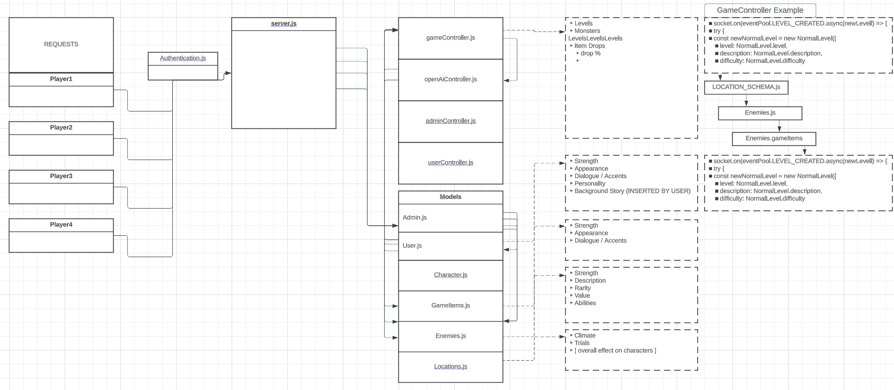

# back-end-testing

- Schemas for clients, users, loot, and dungeons.

# CHAT RPGT

The OpenAI ChatGPT RPG Game

## Project Description

This project uses OpenAI's GPT technology to provide a text-based RPG experience, where the game is run and moderated by an AI Dungeon Master. Built entirely on a Node.js backend, the game leverages the potential of the GPT model to create dynamic, responsive gameplay experiences.

## Table of Contents

- [Installation](#installation)
- [Usage](#usage)
- [Features](#features)
- [Contributing](#contributing)
- [License](#license)
- [Credits](#credits)
- [Documentation](#documentation)
- [Support](#support)
- [Badges](#badges)

## Proposed File Structure

- repository
  |- node_modules
  |- assets
  | |- data
  | | |- characters
  | | |- enemies
  | | |- items
  | | |- maps
  |- src
  | |- controllers
  | | |- gameController.js
  | | |- userController.js
  | | |- openAIController.js
  | | |- adminController.js
  | |- models
  | | |- User.js
  | | |- Character.js
  | | |- Enemies.js
  | | |- Game.js
  | | |- Items.js
  | | |- Admin.js
  | |- routes
  | | |- gameRoutes.js
  | | |- userRoutes.js
  | | |- openAIRoutes.js
  | | |- adminRoutes.js
  | |- utils
  | | |- openAIUtils.js
  | | |- socketUtils.js
  | | |- authUtils.js
  | | |- gameLogicUtils.js
  | |- middleware
  | | |- authenticationMiddleware.js
  | | |- errorHandlingMiddleware.js
  |- tests
  | |- unit
  | |- integration
  |- logs
  |- .env
  |- .gitignore
  |- package-lock.json
  |- package.json
  |- README.md
  |- Dockerfile
  |- server.js

## Installation

1. Clone this repository
2. Run `npm install` in the project root directory
3. Setup environment variables by creating a `.env` file in the root directory. Refer to `.env.example` for necessary variables.
4. Run `npm start` to start the server

## Usage

To interact with the game, send HTTP requests to the appropriate endpoints. For example:

curl http://localhost:3000/game/start

## Features

- AI-driven text-based RPG gameplay
- Player account management
- Admin controls for game management
- End-to-end tests for game mechanics
- Docker support for easy deployment

## Contributing

Please refer to the `CONTRIBUTING.md` file for guidelines on contributing to this project.

## License

This project is licensed under the MIT License. See the `LICENSE` file for more details.

## Credits

- OpenAI for providing the GPT model
- Node.js and various Node.js packages
- All contributors to this project

## Documentation

Refer to the `docs` directory for additional documentation, including design diagrams and API documentation.

## Support

For support, please open an issue on the GitHub repository. You can also contact the maintainers directly via email.

## Badges

- Build: 
- Coverage: 

## Dependencies and Technologies

This project heavily relies on various dependencies and technologies for smooth development and running of the game.

### Backend Technology Stack

- [Node.js](https://nodejs.org/en/): JavaScript runtime built on Chrome's V8 JavaScript engine.
- [Express.js](https://expressjs.com/): Web application framework for Node.js, designed for building web applications and APIs.
- [Socket.io](https://socket.io/): Library for real-time, bidirectional and event-based communication.

### Databases

- [MongoDB](https://www.mongodb.com/): A source-available cross-platform document-oriented database program, used for high volume data storage.

### Testing

- [Mocha](https://mochajs.org/): A feature-rich JavaScript test framework running on Node.js.
- [Chai](https://www.chaijs.com/): A BDD / TDD assertion library for node and the browser that can be paired with any javascript testing framework.

### Other Dependencies

- [dotenv](https://www.npmjs.com/package/dotenv): Module that loads environment variables from a `.env` file into `process.env`.
- [jsonwebtoken](https://www.npmjs.com/package/jsonwebtoken): An implementation of JSON Web Tokens.

### Deployment

- [Docker](https://www.docker.com/): A platform as a service (PaaS) that uses OS-level virtualization to deliver software in packages called containers.

Please refer to `package.json` file for a full list of dependencies.

## Team Agreement

This document outlines our team's strengths, the ways we plan to utilize them for project execution, our professional development goals, and how we plan to approach our daily work.

## Team Members

1. Reed
2. Joshua
3. Tim
4. Justin
5. Ryan

## Key Strengths

### Member 1: Reed

#### Reed Strengths

1. **UMLs**: Reed is adept at creating Unified Modeling Language diagrams, providing clear blueprints for system architecture and flow.
2. **Wireframing**: With a keen eye for design and user experience, Reed can visualize and layout the structure of software or a website before the coding phase begins.
3. **Research**: Reed possesses strong research skills, providing the team with valuable insights and keeping the project aligned with the latest industry trends and best practices. 

- We'll rely on Reed's proficiency with UMLs and wireframing in the design phase of our project to ensure a solid foundation and clear direction.
- His research skills will be invaluable in keeping the team informed of new trends, potential project hurdles, and innovative solutions. 

#### Professional Development Goals

- Reed wishes to improve his coding skills, complementing his design and research abilities. He is particularly interested in learning more about backend development.
- Reed also aims to refine his skills in Agile methodologies to better adapt to shifting project requirements and deliver quality work on time.

### Member 2: Joshua Coffey

#### Joshua Strengths

- Problem solving (love troubleshooting), Constantly trying to learn, and willing to accept and admit when I am wrong.

#### Utilization

- Willing to ask for help so I do not hold the team up and am always willing to help. If we run into a problem I am always willing to help solve it. If I mess up I am willing to own up to it and will not take it personal if that portion of code does not get used.

#### Goals

- Become more efficient with my time usage by learning from my teammates. 
- Learn more backend stuff from people who understand it more than I do.
- Create an awesome project.

#### Day to Day Approach

- Come in with a clear head and ready to complete today’s tasks.

### Member 3: Tim Maupin

- Strengths: Being able to work with people on a team and get the group to have fun but also stay on topic. Good with reviewing and debugging code on the backend, being able to think with an open mind when it comes to different solutions for problems. 
- Utilization: By helping the group with issues they have, make sure the human element still remains while working, meaning checking in on everyone, making sure we take breaks, helping a group member if they feel they are taking on too many responsibilities.
- Improvements: For me I would like to get better at being able to take an idea I have for something and start coding it, feel comfortable doing this on my own outside of a group environment. I would like to get more comfortable with frontend coding but for this project we won’t be doing that, just something for the future.
- Day to Day: Check in with the group members by doing a pseudo stand up and see where everyone is with the tasks they had. See if they need any help or if I need any help. Make sure people feel comfortable enough to ask for that help and/or express any ideas or concerns they have.

### Member 4: Justin

## Justin Strengths

- The ability to adapt to diverse environments and work on diverse teams.

## Utilization of Strengths:

- Being a team player and willing to ask for help and help teammates as much as possible.

## Justin Professional Development Goals

- Improve on the technical aspects of writing code and strive to problem solve to the best of my ability. 

## Justin Day to Day Approach:

Communicate daily and work together to reach our goals.

### Member 5: Ryan

## Key strengths

 Adaptability to nearly any environment. Ability to communicate up and down the chain of command. 

## Implementation

My ability to adapt will allow me to work in the most diverse of environments, and my communication skills will prove valuable in maintaining a reliable means of communication between team members.

## Professional Competencies

I would like to further develop my craft competency as we work together to meet our goals. We will have to utilize a wide arrangement of tools to achieve even our minimum viable product.

## Ryan Day to Day Approach

Starting the day with clearly defined goals and breaking down the tasks will allow each member to contribute to their strengths.

### Conflict Plan

- In the event of a conflict we will all sit down and talk about it and try to reach common ground and if that does not work we will get a mediator.
- In the even someone tries to take over the whole project we will let them know that others need to contibute and if that does not work we will get a mediator.
- We will all be willing to help eachother and explain our thought process on the situation and share our resources.
- We will try and give them tasks that are needed to be done and if that does not work we will have a stand up and talk to eachother like adults.
- We will bring in a mediator.

### Communication Plan

- 9 - 5 Pacific time
- Slack and remo will be the main sources of communication.
- As needed with proper discretion.
- In the event that we fall behind we can go all hands on deck or we can ask a TA or teacher on advice to see if we need to adjust our MVP.
- Stand ups everyone gets their turn to talk before meeting is over.
- Do not talk down on anyone and respect everyone. Make sure we keep allowing everyone to talk without getting put down or spoke over.

### Work Plan

- We will have standups and we will use Trello so that we are able to talk about things and verify them throughout the day.
- Trello

### Presentation Deck

- 

### Git Process

- All components will live on Github
- We have created an organization
- ACP pushes occur before lunch and end of the day and as needed to accomplish group tasks.
- We will be using PR review process with two people reviewing code before merge.
- Anyone can merge them as long as they have been properly reviewed.
- Set schedule and we will be in a remo call together.

### User Stories

#### Multiplayer

- As an user I would like to be able to play this game with my friends.
- Have rooms with 4 player limit so you can play with friends.
- Users succesfully connect to eachothers rooms.

#### Fun Looting

- As an user I want a fun looting system where even though I am playing with my friends I can get different loot then them.
- Create a non shared looting system.
- Loot dropped randomly and split evenly through the party.

#### Dungeon Stories

- As an user I want cool and different stories when I go into the dungeons so that the game does not get boring.
- Use openAI to create a different story every time you go into a dungeon.
- Upon entering a dungeon players are given a unique story.

#### Loot Saving

- As an user I want to be able to save my loot so when I get off and get back on it is still there.
- Use Auth so that users are able to save specific loot on their account and use it through multiple play throughs.
- When logging back in your loot is still there.

#### Fight Friends

- As an user I want to be able to fight my friends to show off my loot.
- Create 1v1 player vs player rooms where players can compete.
- Able to connect to a room where you and a friend can fight.

## UML

